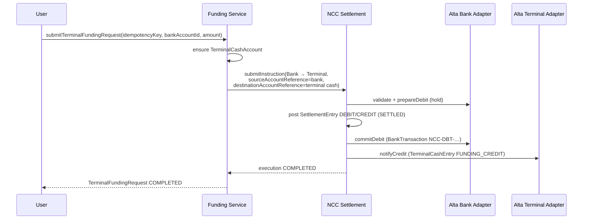
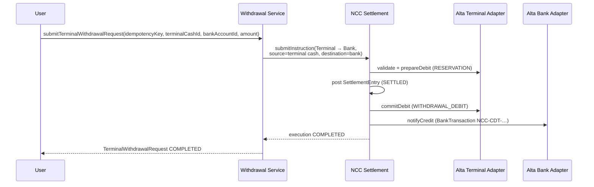

# NCC ↔ Alta Integration

**Newport Clearing Corporation — Sprint 3A / 3B**  
Date: 2026-07-16

Related: [Real-Time Settlement](./NCC_REAL_TIME_SETTLEMENT.md) · [Technical Architecture](./NCC_TECHNICAL_ARCHITECTURE.md) · [Institution API](./NCC_INSTITUTION_API.md) · [Reconciliation](./NCC_RECONCILIATION.md)

---

## 1. System boundaries

```
┌──────────────────┐   ┌──────────────────┐   ┌──────────────────┐
│    Alta Bank     │   │  Alta Terminal   │   │  Alta Exchange   │
│ Customer SoR:    │   │ Trading cash SoR │   │ Same Terminal    │
│ BankAccount /    │   │ TerminalCash*    │   │ cash ledger      │
│ BankTransaction  │   │ (portfolio UI)   │   │ (listings / trade│
│ / BankAccountHold│   │                  │   │  surfaces)       │
└────────┬─────────┘   └────────┬─────────┘   └────────┬─────────┘
         │                      │                      │
         │     InstitutionAdapter (no direct cross-mutation)
         └──────────────────────┼──────────────────────┘
                                ▼
                 ┌────────────────────────────┐
                 │  Newport Clearing Corp.    │
                 │  SettlementInstruction     │
                 │  SettlementExecution       │
                 │  SettlementAccount / Entry │
                 └────────────────────────────┘
```

### Responsibilities

| Layer | Owns | Must not |
|-------|------|----------|
| **NCC** | Interinstitution settlement status, settlement accounts, gross ledger entries, execution orchestration, reconciliation records, outbox events | Mutate BankAccount / TerminalCashAccount outside adapters |
| **Alta Bank** | Customer deposit accounts, holds, bank transactions | Credit Terminal cash directly; bypass NCC for interinstitution moves |
| **Alta Terminal** | Customer trading-cash balances (`TerminalCashAccount` / `TerminalCashEntry`), funding & withdrawal requests | Debit Alta Bank accounts directly |
| **Alta Exchange** | Exchange product UX; settlement legs resolve to the **same** Terminal cash ledger via `AltaExchangeInstitutionAdapter` | Maintain a separate cash SoR for Sprint 3A |

### Adapter availability (3A.1)

Missing adapters fail **before** NCC ledger posting with `SOURCE_ADAPTER_UNAVAILABLE` / `DESTINATION_ADAPTER_UNAVAILABLE`. Institution-float legs (registered adapter, no customer account reference) remain valid no-ops — they are not the same as a missing adapter.

### Terminal cash ownership (3A.1)

`TerminalCashAccount` must have exactly one owner (user XOR company), enforced by a PostgreSQL check constraint plus partial unique indexes on `(ownerUserId, currency)` and `(ownerCompanyId, currency)`. Concurrent provisioning returns the existing account.

### Seed float policy (3A.1)

Alta settlement-account seeds set the initial 1B FLR float **only on create**. Re-seed never rewrites balances.
---

## 2. Adapter contract

```ts
interface InstitutionAdapter {
  institutionKey: string
  validateAccountReference(input): Promise<AdapterValidationResult>
  prepareDebit(input): Promise<AdapterPreparationResult>   // hold / reserve
  commitDebit(input & { holdReference }): Promise<AdapterCommitResult>
  releaseDebit(input): Promise<void>
  notifyCredit(input): Promise<AdapterCreditResult>
}
```

Registry: `institution-adapter.registry.ts`

| Key | Implementation | Ledger |
|-----|----------------|--------|
| `alta-bank` | `AltaBankInstitutionAdapter` | `BankAccount` / `BankAccountHold` / `BankTransaction` |
| `alta-terminal` | `AltaTerminalInstitutionAdapter` | `TerminalCashAccount` / `TerminalCashEntry` |
| `alta-exchange` | `AltaExchangeInstitutionAdapter` (extends Terminal) | Same Terminal cash ledger |

Rules:

- Amounts are decimal **strings**; adapters parse with Prisma.Decimal / `ncc-money` (no JS float math).
- Missing `accountReference` → institution-float no-op (`institution-float:{instructionId}`), not an error.
- All prepare / commit / credit paths are **idempotent** on settlement instruction id (and `nccOperationKey` / entry `idempotencyKey`).

---

## 3. Institution float (Alta settlement accounts)

Alta Bank, Alta Terminal, and Alta Exchange each have an NCC `SettlementAccount` seeded with a large operating float (**1,000,000,000 FLR**) so intra-Alta customer funding/withdrawal legs do not fail on NCC-side liquidity during Sprint 3A.

This float is an **intentional Sprint 3A limitation** — not a credit facility product. Production liquidity policy belongs in a later sprint.

---

## 4. Idempotency keys

| Surface | Scope | Behavior |
|---------|-------|----------|
| Settlement instruction | `(sendingInstitutionId, idempotencyKey)` | Same key + same payload hash → return / resume; different payload → `IDEMPOTENCY_CONFLICT` |
| Terminal funding request | `TerminalFundingRequest.idempotencyKey` (unique) | Same key → return existing request |
| Terminal withdrawal request | `TerminalWithdrawalRequest.idempotencyKey` (unique) | Same key → return existing request |
| Bank hold | `BankAccountHold.nccOperationKey` | `ncc-prep:{instructionId}:{accountId}` |
| Terminal cash entry | `TerminalCashEntry.idempotencyKey` | e.g. `ncc-term-prep:{instructionId}`, commit/credit keys |
| Bank transaction refs | `NCC-DBT-{instructionId}` / `NCC-CDT-{instructionId}` | Prevents double post |
| Outbox | `SettlementOutboxEvent.dedupeKey` | Duplicate enqueue returns existing event |

---

## 5. Bank → Terminal funding

Customer moves funds from an Alta Bank account into their Terminal / Exchange trading-cash account.

Service: `submitTerminalFundingRequest` (`ncc-funding.service.ts`)



Request status mapping:

| Observation | Funding status |
|-------------|----------------|
| Instruction FAILED / CANCELLED / REVERSED | same |
| Execution COMPLETED | `COMPLETED` |
| Mid commit/credit | `SOURCE_COMMITTED` |
| Instruction SETTLED, execution not complete | `NCC_POSTED` |
| Otherwise in flight | `PREPARING` |

---

## 6. Terminal → Bank withdrawal

Customer moves funds from Terminal trading cash back to Alta Bank.

Service: `submitTerminalWithdrawalRequest` (`ncc-withdrawal.service.ts`)



Status mapping mirrors funding (`resolveRequestStatus`).

---

## 7. Reversal and compensation

- NCC ledger reversals use compensating `SettlementInstruction` + `SettlementReversal` (Sprint 1 path), not in-place mutation.
- Post-ledger adapter failures use **retry / manual review**, not automatic compensating customer credits in Sprint 3A.
- `SettlementExecutionStatus.COMPENSATING` is reserved for future automated compensation workflows.

---

## 8. Outbox and Institution API (Sprint 3B)

`SettlementOutboxEvent` + `ncc-outbox.service.ts` provide durable, deduped, retried event delivery.

Sprint 3B wires:

- Institution API credentials (`/api/ncc/v1`)
- Outbox → institution-specific webhook fanout
- Signed HTTPS delivery with SSRF protections
- Developer portal under `/portal/developers`

Alta Bank ↔ Terminal funding/withdrawal continue to use the same settlement engine; machine clients authenticate as their institution and cannot override sender identity. See [NCC_INSTITUTION_API.md](./NCC_INSTITUTION_API.md) and [NCC_WEBHOOKS.md](./NCC_WEBHOOKS.md).
