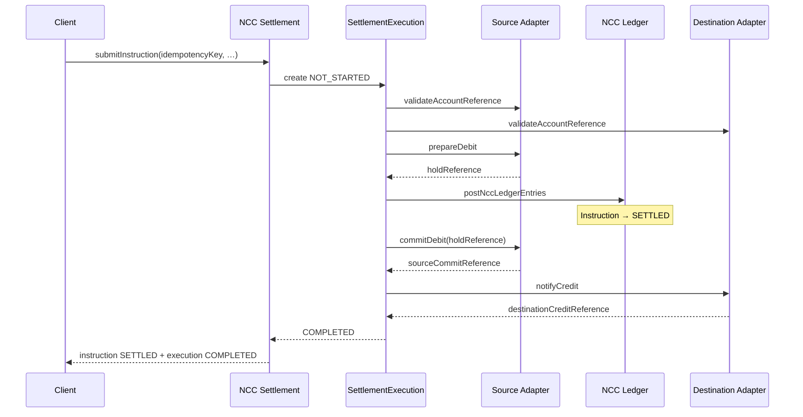
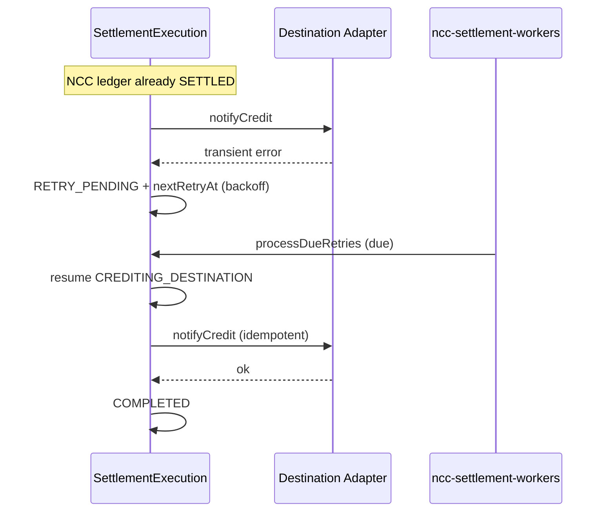
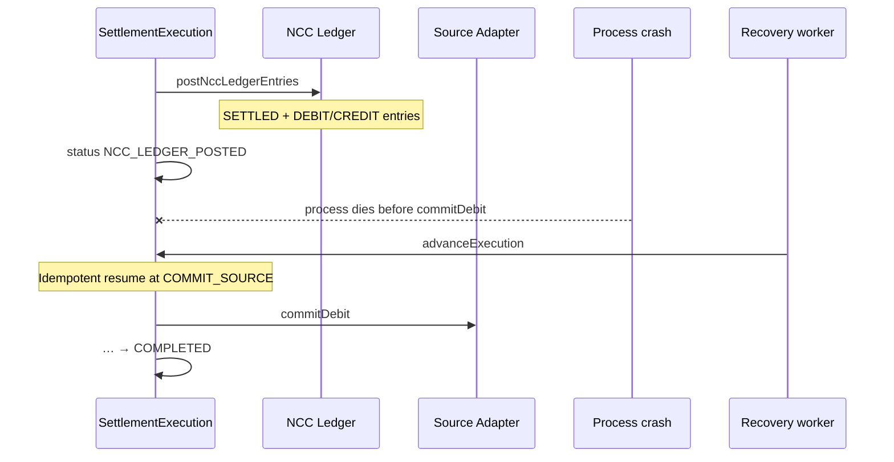

# NCC Real-Time Gross Settlement

**Newport Clearing Corporation — Sprint 3A**  
Date: 2026-07-14

Related: [Technical Architecture](./NCC_TECHNICAL_ARCHITECTURE.md) · [Alta Integration](./NCC_ALTA_INTEGRATION.md) · [Reconciliation](./NCC_RECONCILIATION.md)

---

## 1. Decision

NCC is an **always-on, real-time gross settlement** system.

Every settlement instruction is:

- Processed **individually** (no batch grouping)
- Validated and settled **immediately** on submission
- Available **24/7**
- **Idempotent**, **traceable**, and **recoverable** after crashes

NCC does **not** implement:

- Batch settlement
- Settlement windows / cutoffs for netting
- Netting cycles
- Scheduled delay before posting

Deferred recovery workers (`ncc-settlement-workers`) advance incomplete executions one-by-one. They never batch or net value.

Sprint 3B exposes the same real-time path through `/api/ncc/v1` and fans out outbox events to signed webhooks. API clients cannot opt into delayed or batched clearing.

Related API docs: [Institution API](./NCC_INSTITUTION_API.md) · [Webhooks](./NCC_WEBHOOKS.md)

---

## 2. Finality: SETTLED vs COMPLETED

| Concept | Where | Meaning |
|---------|--------|---------|
| **SETTLED** | `SettlementInstruction.status` | NCC ledger finality. Balanced DEBIT + CREDIT `SettlementEntry` rows are committed; institution settlement-account balances are updated. |
| **COMPLETED** | `SettlementExecution.status` | End-to-end finality. Source institution debit is committed **and** destination institution credit is confirmed via adapters. |

Implications:

- An instruction may be **SETTLED** while execution is still `NCC_LEDGER_POSTED`, `COMMITTING_SOURCE`, `CREDITING_DESTINATION`, `RETRY_PENDING`, or `MANUAL_REVIEW`.
- Customer-facing “fully done” (funding/withdrawal request `COMPLETED`) requires execution **COMPLETED**, not instruction SETTLED alone.
- After NCC ledger post, adapter failures **retry / escalate**; they do not un-settle the NCC ledger.

---

## 3. SettlementExecution state machine

Persisted on `SettlementExecution` (`src/server/ncc/ncc-execution.service.ts`).

### Statuses

```
NOT_STARTED
  → VALIDATING → PREPARING_SOURCE → SOURCE_PREPARED
  → POSTING_NCC_LEDGER → NCC_LEDGER_POSTED
  → COMMITTING_SOURCE → SOURCE_COMMITTED
  → CREDITING_DESTINATION → DESTINATION_CREDITED
  → COMPLETED

Transient / ops:
  RETRY_PENDING  (backoff, then resume at currentStep)
  MANUAL_REVIEW  (max attempts exhausted — no automatic retry)
  COMPENSATING   (authorized post-ledger compensation in progress)
  COMPENSATED    (source restored + NCC positions reversed via compensating entries)
  FAILED         (pre-ledger business failure — non-retryable, including missing adapters)
```

### Adapter availability (Sprint 3A.1)

Both sending and receiving institution adapters **must** be registered before source preparation or NCC ledger posting.

- Missing source adapter → `SOURCE_ADAPTER_UNAVAILABLE` (FAILED, audited)
- Missing destination adapter → `DESTINATION_ADAPTER_UNAVAILABLE` (FAILED, audited)
- Never generate successful `no-adapter:*` execution references
- A registered adapter may still process an institution-float leg with no customer `accountReference`

### Orchestration order

1. **assert adapters** — fail closed if either adapter is missing
2. **validate** — `validateAccountReference` on source and destination adapters (when account refs present)
3. **prepareDebit** — source adapter holds / reserves customer funds
4. **post NCC ledger** — `postNccLedgerEntries` (instruction → SETTLED) + `settlement.ncc_posted` outbox
5. **commitDebit** — source adapter posts the debit
6. **notifyCredit** — destination adapter posts the credit
7. **COMPLETED** — `completedAt` set + `settlement.completed` outbox

### Initial float policy (Sprint 3A.1)

Alta institution seed functions (`ensureAltaBankInstitutionSeeded` / `ensureAltaInternalInstitutionSeeded` / `ensureAltaInstitutionsSeeded`):

- Set the **1B FLR** operating float **only when creating** a settlement account
- **Never** overwrite existing `ledgerBalance` / `availableBalance` on upsert
- Re-running seeds is financially idempotent after settlements have posted
- Institution / routing metadata may still refresh safely
- Explicit float adjustments require a separate authorized, audited admin operation

### Transactional outbox

Financial transitions enqueue durable events inside the same Prisma transaction when possible:

`settlement.submitted` · `settlement.ncc_posted` · `settlement.completed` · `settlement.failed` · `settlement.retry_pending` · `settlement.manual_review` · `settlement.reversed` · `settlement.compensated`

Stable `dedupeKey`s prevent duplicate logical events. Handler failure never reverses settlement.

### Post-ledger compensation

Authorized NCC staff may compensate when NCC is SETTLED, source debit is committed, and destination credit is permanently failed / in manual review (`ncc-compensation.service.ts`).

- Compensating entries only — original records are never edited or deleted
- Requires non-empty reason + actor + timestamp
- Moves execution `COMPENSATING` → `COMPENSATED`
- Restores source once via `compensateDebit`; restores NCC positions via `reverseInstruction`
- Duplicate compensation returns the original record
- Completed executions cannot be compensated
- Active `RETRY_PENDING` requires explicit escalation

### Test transport isolation

Automated NCC tests set `NCC_SETTLEMENT_TESTS=1` / `STAFF_AUDIT_DISCORD_DISABLED=1`. Audit rows still write to the database; production Discord delivery is skipped.
State transitions are persisted **before** each external call so a crash mid-step resumes by re-attempting the same step. Adapter operations and ledger posting are idempotent.

---

## 4. Crash recovery

| Failure point | Behavior |
|---------------|----------|
| Crash before prepare | Re-submit / worker resumes at VALIDATE / PREPARE_SOURCE |
| Crash after prepare, before NCC post | Resume POST_NCC_LEDGER; hold remains (idempotent prepare) |
| Crash after NCC post | Instruction already SETTLED; resume COMMIT_SOURCE / CREDIT_DESTINATION |
| Duplicate submit (same idempotency key) | Returns existing instruction and resumes incomplete execution |
| Process kill mid-`advanceExecution` | Next worker pass or re-submit continues from persisted status |

Workers: `runNccSettlementWorkers` → `processDueRetries` + outbox + reconciliation sweep. Each incomplete execution is advanced independently.

---

## 5. Retry policy

Implemented in `scheduleRetry` / `processDueRetries`:

- Transient adapter / unexpected errors → `RETRY_PENDING`
- Backoff: `min(2^attemptCount * 30s, 30m)`
- Default `maxAttempts`: **8**; then → `MANUAL_REVIEW`
- Non-retryable ledger codes (`INSUFFICIENT_FUNDS`, `NEGATIVE_BALANCE_DENIED`, etc.) → execution `FAILED` (and instruction FAILED only if ledger not yet posted)
- Post-ledger commit/credit failures → retry / manual review; **instruction stays SETTLED**

---

## 6. Performance target

From `getNccIntegrationHealth`:

- Normal synchronous completion: **a few seconds or less** (target ≤ ~5s)
- **No scheduled settlement delay** (`scheduledDelaySeconds: 0`)
- Durable async recovery when synchronous completion cannot finish

---

## 7. Sequence diagrams

### Successful execution



### Adapter failure and retry



### Crash after NCC posting



---

## 8. Instruction lifecycle (unchanged spine)

```
CREATED → SUBMITTED → VALIDATING → SETTLING → SETTLED
                         ↘ FAILED
         CANCELLED (before settlement / not while SETTLING)
         SETTLED → REVERSED (compensating instruction)
```

`QUEUED` remains in the enum for legacy compatibility but is not used as a batching gate. Real-time execution starts immediately after submit/validate.
