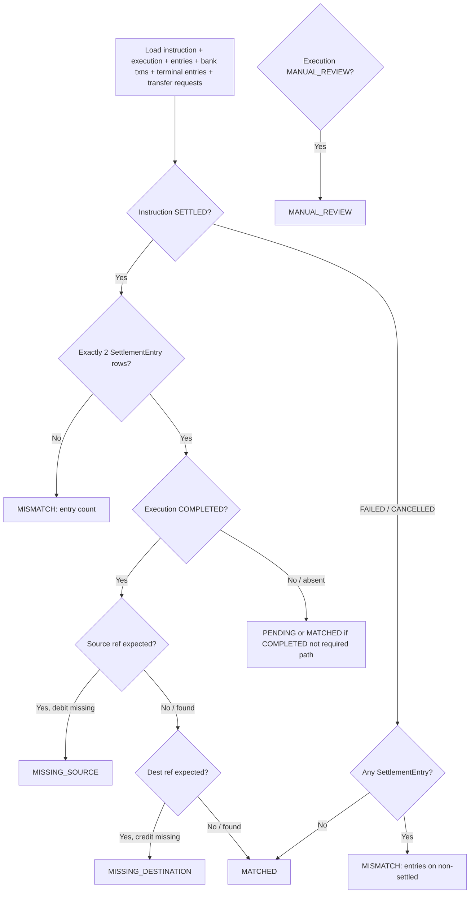

# NCC Reconciliation

**Newport Clearing Corporation — Sprint 3A**  
Date: 2026-07-14

Related: [Real-Time Settlement](./NCC_REAL_TIME_SETTLEMENT.md) · [Alta Integration](./NCC_ALTA_INTEGRATION.md)

---

## 1. Purpose

Reconciliation compares a single settlement instruction against every system it may have touched and records a durable `SettlementReconciliation` finding. It detects partial failures and ledger mismatches; it does **not** silently repair balances.

Implementation: `src/server/ncc/ncc-reconciliation.service.ts`

---

## 2. What is compared

For `reconcileInstruction(instructionId)`:

| Source | Checked |
|--------|---------|
| `SettlementInstruction` | Status |
| `SettlementExecution` | Status; whether source/destination account refs imply side effects |
| `SettlementEntry` | Count / presence for SETTLED vs non-settled |
| Alta Bank | `BankTransaction` `NCC-DBT-{id}` / `NCC-CDT-{id}` |
| Terminal cash | `TerminalCashEntry` with `WITHDRAWAL_DEBIT` / `FUNDING_CREDIT` for the instruction |
| Transfer requests | Linked `TerminalFundingRequest` / `TerminalWithdrawalRequest` |

Findings are stored as JSON on `SettlementReconciliation.findings`.

---

## 3. Statuses

`SettlementReconciliationStatus`:

| Status | Meaning |
|--------|---------|
| `MATCHED` | No mismatches; SETTLED with COMPLETED (or no execution) and expected entries, or FAILED/CANCELLED with zero entries |
| `PENDING` | In flight / not yet classifiable as match or mismatch |
| `MISMATCH` | Structural inconsistency (e.g. wrong entry count) not classified as missing side effect |
| `MISSING_SOURCE` | Execution COMPLETED but expected source debit side effect absent |
| `MISSING_DESTINATION` | Execution COMPLETED but expected destination credit side effect absent |
| `DUPLICATE` | Reserved |
| `STALE_RESERVATION` | Reserved (stale holds are also surfaced in health metrics) |
| `MANUAL_REVIEW` | Execution is in `MANUAL_REVIEW` |
| `COMPENSATED` | Execution reached `COMPENSATED` after authorized post-ledger compensation |
| `RESOLVED` | Operator closed the finding with a note |

### Compensated settlements (3A.1)

When an execution is `COMPENSATED`, reconciliation records status `COMPENSATED`. Compensation restores source customer value once and reverses NCC settlement positions through compensating instruction entries — original financial rows are never edited or deleted.
---

## 4. What reconciliation may and may not do

### May

- Create append-only reconciliation records
- Sweep recently terminal instructions with no record (`runReconciliationSweep`)
- Escalate visibility when execution is `MANUAL_REVIEW`
- Allow operators to **resolve** a finding with a required note + audit (`NCC_RECONCILIATION_RESOLVED`)

### Must not

- Mutate `SettlementAccount` balances
- Post or reverse `SettlementEntry` rows
- Commit/release bank holds or terminal reservations
- Mark instructions SETTLED / COMPLETED
- “Fix” mismatches without a separate, audited settlement or compensation flow

Resolution marks the **reconciliation record** resolved; it does not rewrite ledgers.

---

## 5. Mismatch detection diagram

---

## 6. Resolution auditing

`resolveReconciliation(id, actorUserId, note)`:

1. Requires non-empty `resolutionNote`
2. Sets status `RESOLVED`, `resolvedAt`, `resolvedByUserId`
3. Writes audit log:
   - action: `NCC_RECONCILIATION_RESOLVED`
   - entity: `SETTLEMENT_RECONCILIATION`
   - metadata includes note + `settlementInstructionId`

Operators should attach the follow-up action (manual credit, compensating instruction, hold release) in the note; reconciliation itself only closes the finding.

---

## 7. Operational sweep

`runNccSettlementWorkers` periodically calls `runReconciliationSweep` for instructions in `SETTLED` or `FAILED` that have no reconciliation rows yet. This keeps partial-failure detection continuous without blocking the real-time settlement path.
