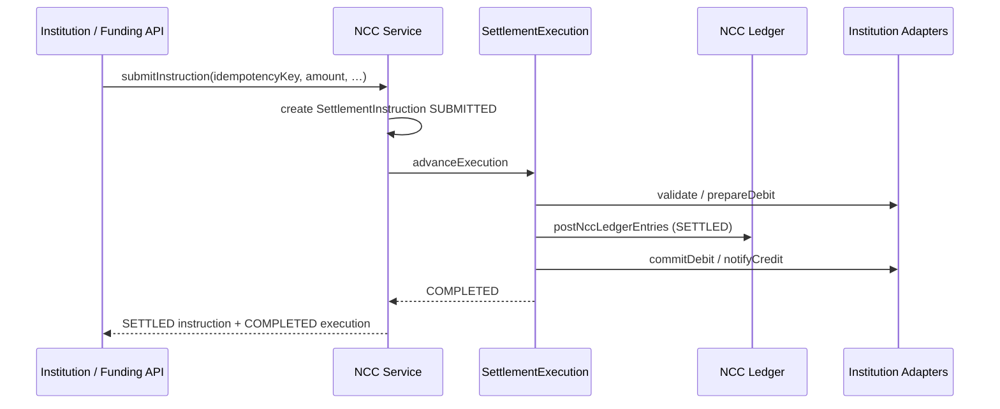
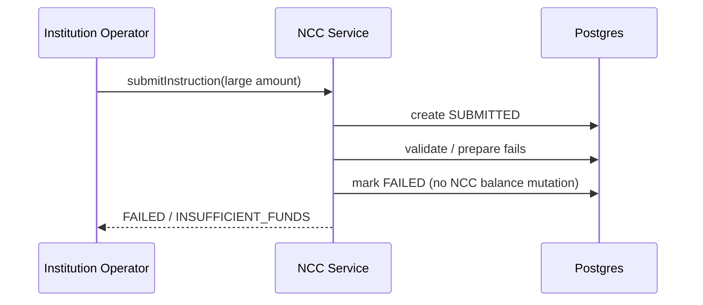
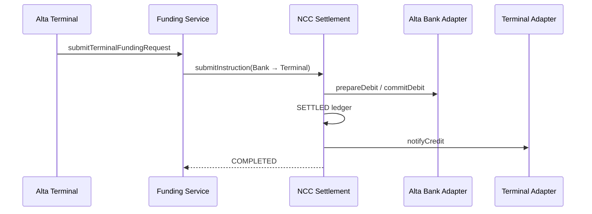
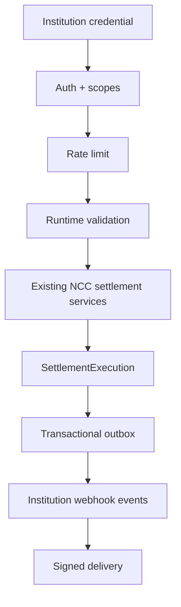

# NCC Technical Architecture

**Newport Clearing Corporation — Sprint 1–3B**  
Date: 2026-07-16

**Sprint 3A docs:** [Real-Time Settlement](./NCC_REAL_TIME_SETTLEMENT.md) · [Alta Integration](./NCC_ALTA_INTEGRATION.md) · [Reconciliation](./NCC_RECONCILIATION.md) · [Sprint 3A Report](./NCC_SPRINT_3A_REPORT.md) · [Portal Architecture](./NCC_PORTAL_ARCHITECTURE.md)

**Sprint 3B docs:** [Institution API](./NCC_INSTITUTION_API.md) · [API Authentication](./NCC_API_AUTHENTICATION.md) · [Webhooks](./NCC_WEBHOOKS.md) · [Webhook Security](./NCC_WEBHOOK_SECURITY.md) · [Sprint 3B Report](./NCC_SPRINT_3B_REPORT.md)

---

## 1. NCC Purpose

Newport Clearing Corporation (NCC) is the financial infrastructure layer for the Alta ecosystem. NCC is responsible for:

- Institution registration and lifecycle
- Routing number allocation
- Institution settlement accounts (NCC-level positions)
- Interinstitution settlement instructions
- Immutable settlement ledger entries
- **Real-time gross settlement execution** (Sprint 3A)
- Reversals via compensating records
- Network risk controls (status gates)
- Reconciliation findings
- Audit history for sensitive actions

Alta Bank, Alta Exchange, Alta Terminal, and future approved institutions use NCC for movement of funds **between institutions**. Customer account balances remain owned by each institution and are mutated only through **InstitutionAdapter** implementations.

---

## 2. System Boundaries

```
┌─────────────────┐     ┌─────────────────┐     ┌─────────────────┐
│   Alta Bank     │     │ Alta Exchange   │     │ Alta Terminal   │
│ (customer SoR)  │     │ (shares Term.   │     │ (trading cash   │
│                 │     │  cash ledger)   │     │  SoR)           │
└────────┬────────┘     └────────┬────────┘     └────────┬────────┘
         │                       │                       │
         │         InstitutionAdapter boundary           │
         └───────────────────────┼───────────────────────┘
                                 ▼
                    ┌────────────────────────┐
                    │   NCC Settlement Engine │
                    │  SettlementAccount SoR │
                    │  SettlementInstruction │
                    │  SettlementExecution   │
                    │  SettlementEntry       │
                    └────────────────────────┘
```

**Rules:**

1. NCC is the source of truth for **interinstitution settlement status** and settlement-account balances.
2. Each institution remains SoR for its **own customer accounts**.
3. NCC never directly edits arbitrary customer balances; it uses institution adapters.
4. Alta Terminal must not mutate Alta Bank balances directly.
5. All interinstitution money movement uses an NCC settlement instruction + execution.

Detail: [NCC_ALTA_INTEGRATION.md](./NCC_ALTA_INTEGRATION.md).

---

## 3. Terminology

| Term | Meaning |
|------|---------|
| FinancialInstitution | Bank, exchange, payment provider, clearing participant, etc. |
| RoutingNumber | NCC-assigned identifier for routing instructions |
| SettlementAccount | NCC ledger position per institution + currency |
| SettlementInstruction | Request to move value between institutions |
| SettlementEntry | Immutable debit/credit created at NCC ledger post |
| SettlementExecution | End-to-end orchestrator; COMPLETED = destination credit confirmed |
| SettlementReversal | Link between original SETTLED instruction and compensating instruction |
| InstitutionMember | User authorized for an institution |
| InstitutionAdapter | Abstraction for institution-specific customer-ledger side effects |
| TerminalCashAccount | Alta Terminal / Exchange trading-cash SoR |

---

## 4. Data Model

### Reused / evolved models

- `FinancialInstitution`, `RoutingNumber`, `InstitutionMember`
- `SettlementAccount`, `SettlementInstruction`, `SettlementEntry`, `SettlementReversal`

### Sprint 3A models

- `SettlementExecution`
- `TerminalCashAccount`, `TerminalCashEntry`
- `TerminalFundingRequest`, `TerminalWithdrawalRequest`
- `SettlementOutboxEvent`
- `SettlementReconciliation`

Money uses `Decimal(18, 2)` (same as Alta Bank). Default currency: `FLR`.

---

## 5. Institution Lifecycle

```
APPLICANT → ACTIVE → RESTRICTED / SUSPENDED → TERMINATED
                 ↘ INACTIVE (legacy)
```

- Only **ACTIVE** institutions may **originate** new instructions.
- **ACTIVE** or **RESTRICTED** may **receive** credits.
- **SUSPENDED** / **TERMINATED** / **INACTIVE** cannot originate.

---

## 6. Routing Number Lifecycle

```
RESERVED → ACTIVE → SUSPENDED → RETIRED
                      ↘ INACTIVE (legacy)
```

- Globally unique `routingNumber`
- Active numbers cannot be reused
- Allocation via `assignRoutingNumber` / `allocateRoutingNumberCandidate` — never UI-generated

---

## 7. Settlement Instruction Lifecycle

```
CREATED → SUBMITTED → VALIDATING → SETTLING → SETTLED
                         ↘ FAILED
         CANCELLED (before settlement; denied while SETTLING)
         SETTLED → REVERSED (via compensating instruction)
```

Clients cannot set status. Transitions are server-controlled.

`QUEUED` remains in the status enum for compatibility but is **not** a batching gate. Sprint 3A settles instructions individually and immediately.

### SETTLED vs COMPLETED

| Status | System | Meaning |
|--------|--------|---------|
| **SETTLED** | `SettlementInstruction` | NCC ledger finality (balanced entries + settlement-account balances) |
| **COMPLETED** | `SettlementExecution` | End-to-end finality (source commit + destination credit) |

An instruction can be SETTLED while execution is still retrying destination credit. See [NCC_REAL_TIME_SETTLEMENT.md](./NCC_REAL_TIME_SETTLEMENT.md).

---

## 8. Settlement Ledger Rules

1. Ledger post runs in a single DB transaction with row locks (`postNccLedgerEntries`).
2. Each settlement creates one **DEBIT** and one **CREDIT** entry (balanced).
3. Entries are append-only.
4. Settlement-account balances cannot go negative (no credit facility).
5. Instruction status becomes **SETTLED** only after that transaction commits.
6. Failed validation does not mutate balances.
7. Adapter prepare/commit/credit are orchestrated by `SettlementExecution` around the ledger post — not best-effort afterthoughts.

---

## 9. Real-Time Gross Settlement (Sprint 3A)

**Intended direction:** always-on real-time gross settlement.

- Every instruction processed individually
- Validated and settled immediately
- Available 24/7
- Idempotent, traceable, crash-recoverable

**Not intended direction:**

- Batch settlement
- Settlement windows
- Netting cycles
- Scheduled delay before posting

`SettlementBatch` / netting are **out of scope and not on the roadmap** as the primary settlement model. Recovery workers advance incomplete executions one-by-one; they do not net value.

Orchestration order: validate → prepareDebit → post NCC ledger → commitDebit → notifyCredit → COMPLETED.

---

## 10. Idempotency Strategy

- Scoped by `(sendingInstitutionId, idempotencyKey)` unique constraint
- Payload hash (`requestHash`) stored on instruction
- Same key + same payload → return existing instruction (and resume incomplete execution)
- Same key + different payload → `IDEMPOTENCY_CONFLICT`
- Concurrent creates race-safe via unique constraint + re-read
- Adapter-level keys: bank `nccOperationKey`, terminal entry `idempotencyKey`, funding/withdrawal request keys

---

## 11. Reversal Strategy

- Dedicated `SettlementReversal` links original ↔ compensating instruction
- Compensating instruction is SETTLED with `REVERSAL_DEBIT` / `REVERSAL_CREDIT` entries
- Original becomes `REVERSED`
- One reversal per original (`originalInstructionId` unique)
- Post-ledger adapter failures use retry / manual review; authorized compensation uses `COMPENSATING` → `COMPENSATED` (`ncc-compensation.service.ts`)
- Missing adapters fail closed before ledger post (`SOURCE_ADAPTER_UNAVAILABLE` / `DESTINATION_ADAPTER_UNAVAILABLE`)
- Settlement outbox events commit with financial state transitions; delivery is asynchronous
- Terminal cash ownership is DB-enforced (exactly one owner; unique owner/currency)
- Alta seed float is create-only — never overwrites existing balances
- NCC automated tests isolate Discord staff-audit delivery (`NCC_SETTLEMENT_TESTS` / `STAFF_AUDIT_DISCORD_DISABLED`)

---

## 12. Institution Adapter Architecture

```ts
interface InstitutionAdapter {
  institutionKey: string
  validateAccountReference(input)
  prepareDebit(input)
  commitDebit(input)
  releaseDebit(input)
  notifyCredit(input)
}
```

Sprint 3A **real** adapters:

- `AltaBankInstitutionAdapter` — BankAccount / holds / transactions
- `AltaTerminalInstitutionAdapter` — TerminalCashAccount / entries
- `AltaExchangeInstitutionAdapter` — same Terminal cash ledger (`alta-exchange` key)

External institutions will implement the same interface behind authenticated transports later.

---

## 13. Authentication and Permissions

### NCC staff

`requireNccStaff()` — currently Alta Group `admin` / `operator` (`canAccessInternal`). Dedicated `NCC_ADMIN` / `NCC_OPERATOR` tags deferred.

### Institution membership roles

- INSTITUTION_OWNER
- INSTITUTION_ADMIN
- SETTLEMENT_MANAGER
- SETTLEMENT_OPERATOR
- AUDITOR
- VIEWER

Permissions enforced server-side via `requireInstitutionPermission`.

---

## 14. Audit Logging

Actions use `NCC_*` constants in `src/lib/ncc/ncc-audit-actions.ts` and write through existing `writeAuditLog` with `AuditEntityType` values (`FINANCIAL_INSTITUTION`, `SETTLEMENT_INSTRUCTION`, `SETTLEMENT_EXECUTION`, terminal/funding entities, etc.).

Sprint 3A: `AuditLog.institutionId` + portal entity-graph filtering for institution isolation.

---

## 15. Failure Handling

| Failure | Behavior |
|---------|----------|
| Insufficient funds (pre-ledger) | Instruction / execution → FAILED; balances unchanged |
| Unusable routing | Reject at submit |
| Suspended sender | Reject at submit |
| Cancel after settle | Denied |
| Cancel while SETTLING | Denied |
| Double settle | Idempotent no-op (already SETTLED) |
| Adapter failure after NCC post | Retry / MANUAL_REVIEW; NCC ledger remains SETTLED |
| Adapter notify (destination) failure | Same — destination credit retried until COMPLETED |

---

## 16. Future External API Design

Internal server functions remain the primary surface (`src/lib/ncc/ncc-settlement.functions.ts`, funding/withdrawal services, portal functions).

Later (Sprint 3B+): authenticated institution API (mTLS or signed requests) and signed webhook delivery on top of `SettlementOutboxEvent`. No broad public API yet.

---

## 17. Deferred (not Sprint 3A direction)

- Batch / net settlement / settlement windows *(explicitly not intended)*
- Full webhook management UI / external credentials
- Dedicated NCC staff UserTags
- External institution networking / public OpenAPI
- Multi-currency FX
- Credit facilities / overdraft
- Production liquidity policy replacing large Alta seed float

---

## Sequence Diagrams

### Real-time settlement → success



### Failed settlement (insufficient funds, pre-ledger)



### Reversal

```mermaid
sequenceDiagram
  participant Staff as NCC Staff
  participant API as NCC Service
  participant DB as Postgres

  Staff->>API: reverseInstruction(id, reason)
  API->>DB: lock original SETTLED
  API->>DB: create compensating instruction + REVERSAL entries
  API->>DB: link SettlementReversal; mark original REVERSED
  API-->>Staff: REVERSED original
```

### Alta Bank → Alta Terminal funding



Full funding/withdrawal sequences: [NCC_ALTA_INTEGRATION.md](./NCC_ALTA_INTEGRATION.md).

---

## Sprint 3B — Institution API boundary

Sprint 3B adds a versioned machine API under `/api/ncc/v1` without changing the Sprint 3A financial core.



See [NCC_INSTITUTION_API.md](./NCC_INSTITUTION_API.md) and [NCC_SPRINT_3B_REPORT.md](./NCC_SPRINT_3B_REPORT.md).
