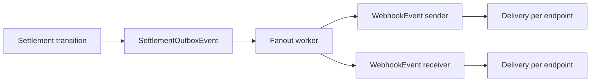
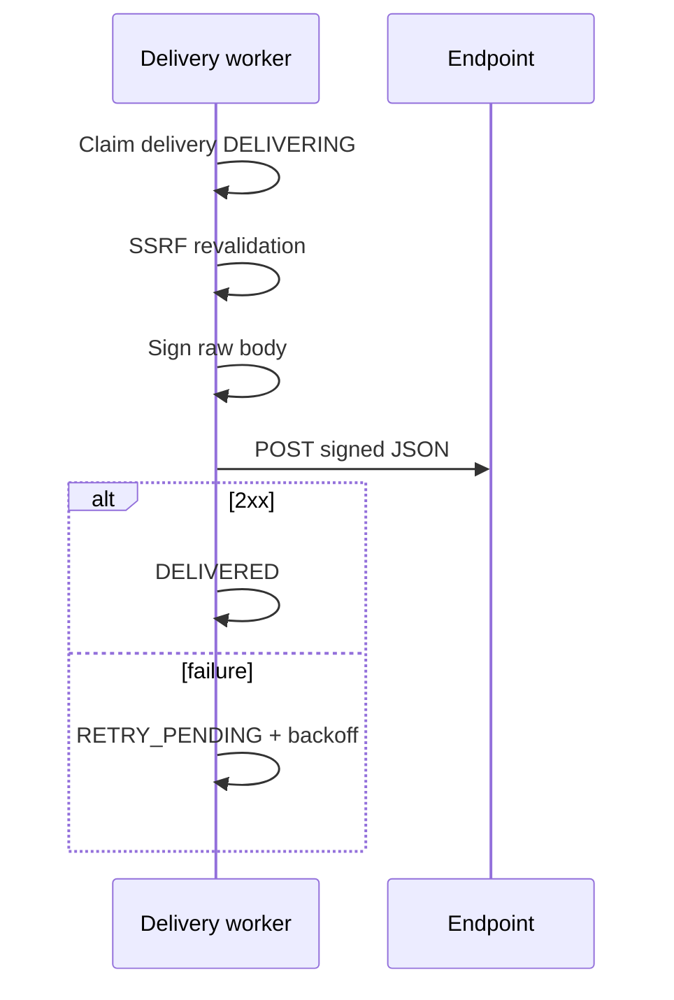
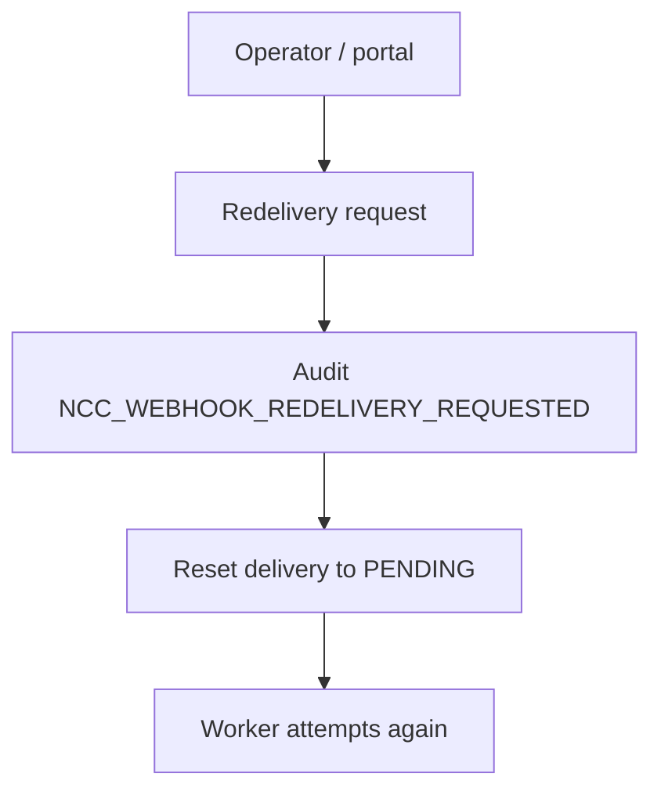

# NCC Webhooks

**Newport Clearing Corporation — Sprint 3B**

Related: [Webhook Security](./NCC_WEBHOOK_SECURITY.md) · [Institution API](./NCC_INSTITUTION_API.md) · [Real-Time Settlement](./NCC_REAL_TIME_SETTLEMENT.md)

---

## 1. Event source

Webhook events are fanout from the existing **transactional settlement outbox**. There is no second financial event bus.

Supported settlement events:

- `settlement.submitted`
- `settlement.ncc_posted`
- `settlement.completed`
- `settlement.failed`
- `settlement.retry_pending`
- `settlement.manual_review`
- `settlement.reversed`
- `settlement.compensated`

Each outbox event fans out to sending (and, where appropriate, receiving) institutions with institution-specific payloads and redaction.

---

## 2. Models

| Model | Role |
|-------|------|
| `NccWebhookEndpoint` | Institution HTTPS destination + subscriptions |
| `NccWebhookEvent` | Institution-scoped event payload |
| `NccWebhookDelivery` | One logical delivery per event/endpoint |

Unique constraint: `(webhookEventId, webhookEndpointId)`.

Delivery statuses: `PENDING`, `DELIVERING`, `DELIVERED`, `RETRY_PENDING`, `FAILED`, `CANCELLED`.

---

## 3. Fanout diagram



---

## 4. Payload schema

```json
{
  "id": "evt_...",
  "type": "settlement.completed",
  "created": "2026-07-16T12:00:00.000Z",
  "data": {
    "reference": "NCC-...",
    "status": "SETTLED",
    "executionStatus": "COMPLETED",
    "amount": "100.00",
    "currency": "FLR"
  }
}
```

Consumers must deduplicate on `id` (event ID). Ordering metadata is preserved; out-of-order delivery is possible after retries.

Sender vs receiver payloads differ: private counterparty account references are redacted for the other side.

---

## 5. Signing headers

| Header | Purpose |
|--------|---------|
| `NCC-Event-Id` | Stable event ID |
| `NCC-Event-Type` | Event type |
| `NCC-Delivery-Id` | Delivery attempt identity |
| `NCC-Timestamp` | Unix seconds |
| `NCC-Signature` | HMAC-SHA256 hex |

Signature input: `timestamp + "." + rawBody`  
Algorithm: `HMAC-SHA256(signingSecret, input)`

Tolerance: recommend ±300 seconds.

---

## 6. Delivery and retry



- Exponential backoff with jitter; bounded `maxAttempts` (default 12)
- Disabled endpoints stop new attempts (`CANCELLED`)
- Manual redelivery is audited
- **Webhook failure never changes settlement finality**

---

## 7. Manual redelivery



---

## 8. Portal

Institution portal → **Developers**:

- `/portal/developers/webhooks`
- `/portal/developers/webhooks/:id`

Create, rotate secret (shown once), enable/disable, send test, inspect sanitized delivery history, redeliver.

---

## 9. Example verification

### TypeScript

```ts
import { createHmac, timingSafeEqual } from "node:crypto";

function verify(secret: string, timestamp: string, rawBody: string, signature: string) {
  const expected = createHmac("sha256", secret)
    .update(`${timestamp}.${rawBody}`)
    .digest("hex");
  const a = Buffer.from(expected);
  const b = Buffer.from(signature);
  return a.length === b.length && timingSafeEqual(a, b);
}
```

### Python

```python
import hmac, hashlib

def verify(secret: str, timestamp: str, raw_body: str, signature: str) -> bool:
    expected = hmac.new(
        secret.encode(), f"{timestamp}.{raw_body}".encode(), hashlib.sha256
    ).hexdigest()
    return hmac.compare_digest(expected, signature)
```

### cURL (inspect headers only)

```bash
# Your receiver should log NCC-* headers and verify before processing.
```

---

## 10. Known limitations

- Optional `routing.status_changed` / `institution.status_changed` events are not yet subscribed by default
- Test-mode endpoints still block private networks (no production-unsafe local bypass)
- Database-backed delivery workers; scale horizontally with job locking (status claim)
