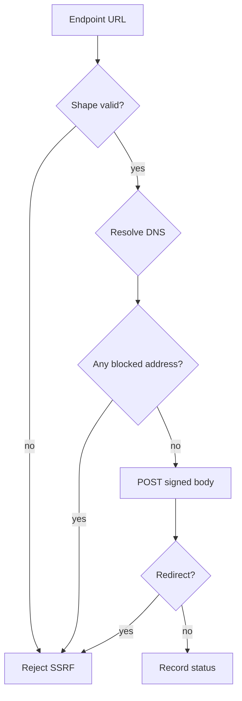

# NCC Webhook Security

**Newport Clearing Corporation — Sprint 3B**

Related: [Webhooks](./NCC_WEBHOOKS.md) · [API Authentication](./NCC_API_AUTHENTICATION.md)

---

## 1. Signing secret storage

Unlike API authentication secrets, webhook signing requires NCC to possess key material at delivery time.

| Approach | Used |
|----------|------|
| One-way hash only | **No** (cannot re-sign) |
| AES-GCM authenticated encryption | **Yes** (`encryptSecret` / `decryptSecret`) |
| Key source | **Production:** `NCC_SECRETS_KEY` required (min 32). Non-prod may fall back to `SESSION_SECRET` / explicit dev pepper. |
| Ciphertext version | `v1.<iv>.<ciphertext>` — changing `NCC_SECRETS_KEY` without re-encryption makes secrets undecryptable |

Raw signing secrets are shown once at endpoint creation or rotation. Plaintext is never stored.


---

## 2. Signature

```
NCC-Signature = hex(HMAC-SHA256(secret, timestamp + "." + rawBody))
```

- Sign the **exact** raw request body
- Do not mutate JSON after signing
- Include `NCC-Timestamp`
- Verify with constant-time comparison
- Suggested clock skew tolerance: 300 seconds

### Test vector

| Field | Value |
|-------|-------|
| Secret | `whsec_test_vector_do_not_use_in_production` |
| Timestamp | `1720000000` |
| Raw body | `{"hello":"ncc"}` |

Compute HMAC-SHA256 over `1720000000.{"hello":"ncc"}` and compare hex digests.

---

## 3. SSRF protections

Webhook delivery is a high-risk egress boundary.

### Rejected at URL shape validation

- Non-HTTPS in LIVE mode
- Embedded credentials (`user:pass@`)
- `localhost` / `.localhost` / `.local` / `.internal`
- Literal loopback, private, link-local, multicast IPv4/IPv6
- Cloud metadata addresses (`169.254.169.254`, metadata hostnames)
- Dangerous schemes

### Rejected at delivery time

- DNS resolution to prohibited addresses (mixed public/private answers fail closed)
- Connection is **pinned** to a validated public IP (Node `http`/`https` with custom `lookup`); TLS SNI and HTTP `Host` keep the original hostname — no second unpinned resolve
- Redirects rejected
- Excessive response size (snippet capped)
- Soft timeouts (connect + total)



**Important:** JavaScript bitwise IP checks use unsigned (`>>> 0`) comparisons so high-bit addresses (e.g. `169.254.169.254`) are correctly classified as blocked.

TEST environment still blocks internal networks unless a narrowly controlled local testing mode exists (none is enabled in production).

---

## 4. Delivery hardening

| Control | Value |
|---------|-------|
| Method | `POST` only |
| Redirects | Denied |
| User-Agent | Controlled NCC agent |
| Internal headers | Not forwarded |
| Response body to users | Sanitized snippet only |
| Settlement impact | None |

---

## 5. Secret rotation

Rotation issues a new signing secret (shown once), encrypts it at rest, and updates the endpoint. Prior secret is invalidated immediately unless an intentional overlap window is later added (default: immediate).

---

## 6. Security recommendations for receivers

1. Verify signature before parsing business logic
2. Reject stale timestamps
3. Deduplicate on `NCC-Event-Id`
4. Treat deliveries as at-least-once
5. Store only hashed/encrypted copies of your webhook secret
6. Prefer allowlisted source networks if your edge supports it
